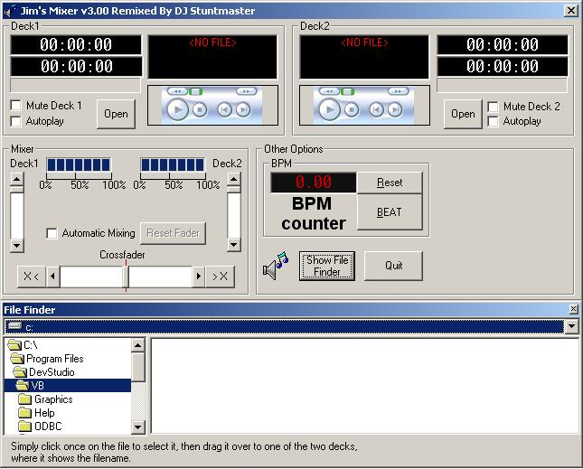



## Mixer with crossfader \- V3\.00 Remixed By Stuntmaster

### Description

This is basically James Comptons Code - but, have Added tons of things to it.

New GUI, works with WMP Ver 9 and above (only), added automixer, bpm is now main window, added progressbar for current position, and finally added an option to turn autoplay on/off.
 
### More Info
 

             |
---                |---
**Submitted On**   |2005-07-10 22:24:14
**By**             |[Benjamin Grant](https://github.com/Planet-Source-Code/PSCIndex/blob/master/ByAuthor/benjamin-grant.md)
**Level**          |Beginner
**User Rating**    |5.0 (10 globes from 2 users)
**Compatibility**  |VB 5\.0, VB 6\.0
**Category**       |[Sound/MP3](https://github.com/Planet-Source-Code/PSCIndex/blob/master/ByCategory/sound-mp3__1-45.md)
**World**          |[Visual Basic](https://github.com/Planet-Source-Code/PSCIndex/blob/master/ByWorld/visual-basic.md)
**Archive File**   |[Mixer\_with1912777132005\.zip](https://github.com/Planet-Source-Code/benjamin-grant-mixer-with-crossfader-v3-00-remixed-by-stuntmaster__1-61621/archive/master.zip)

